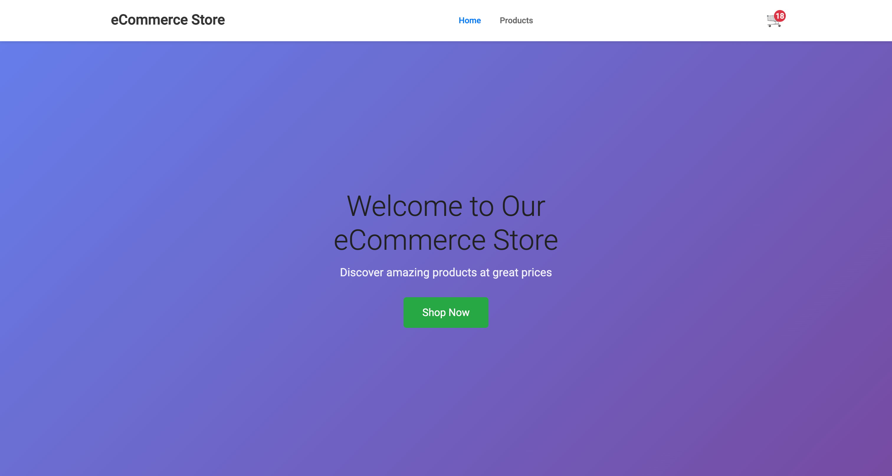
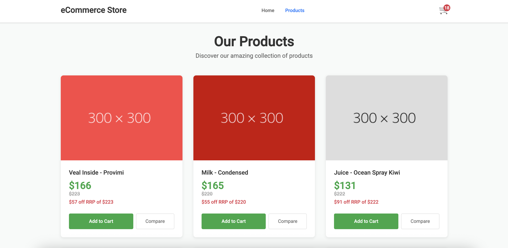
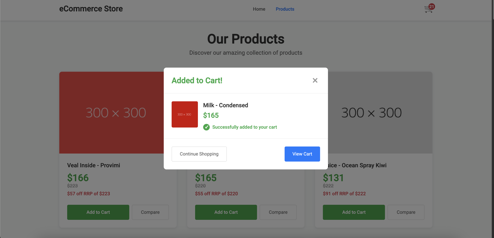
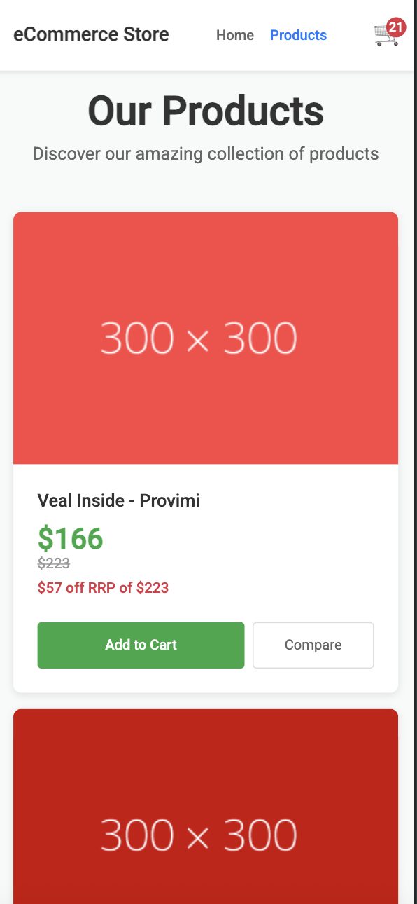

# Angular 20 E-commerce Sample

This repository is **my implementation of a take-home assignment provided by the hiring team**. It’s a small, feature-complete e-commerce app built with **Angular 20** and **NgRx 20**, showcasing practical patterns for state management, standalone components, signals, and modern tooling.

---

## What this demonstrates

- **Typed state with NgRx 20**: feature slices, selectors, and local-storage persistence.
- **Standalone architecture**: no `NgModule`s; components and routing are standalone.
- **Signal-based UI**: `toSignal`/signals where they add clarity.
- **Clean HTTP layer**: a small `ResourceService` abstraction for requests.
- **Developer tooling & guardrails**:
  - **Husky** Git hooks to enforce checks before commits/pushes.
  - **lint-staged** to run ESLint/Prettier only on changed files for fast feedback.
  - **Commitlint** with **Conventional Commits** to keep clean, parseable commit history.
  - **ESLint + Prettier** integration for consistent code style.
  - Optional **EditorConfig** to align basic editor settings across environments.

---

## ✨ Features

- **Home & Product Listing**
  - Route-based navigation (`/home`, `/products`) with Angular’s standalone router.

- **Add to Cart + Modal**
  - Clicking **Add to Cart** opens a dialog, dispatches an NgRx action, and updates totals.

- **Live Cart Totals in Header**
  - Store selectors converted to **signals** for real-time count/value.

- **Persistent State**
  - `ngrx-store-localstorage` rehydrates `cart` and `products` between sessions.

- **Sample Data**
  - Products served from `public/products.json` for quick demos and tests.

---

## 🧠 Angular 20 highlights

- **Standalone bootstrap** with `ApplicationConfig`.
- **Signals** (`signal`, `computed`, `toSignal`) for reactive UI.
- **New control flow**: `@if`/`@for` and deferred templates.
- **Zone-less ready**: can opt into `provideZoneChangeDetection`.
- **NgRx 20**: typed selectors and reducers with local-storage sync.

---

## 🧰 Tooling & DX

- **Testing**: Jest unit tests, Playwright E2E (navigation + basic user journey).
- **HTTP & error handling**: request abstraction, loading/error interceptors, global error handler.
- **Code quality**: ESLint, Prettier, Husky, lint-staged, and Conventional Commits.

---

## Environment setup

Create `src/environments/environment.ts`:

````ts
export const environment = {
  production: false,
  apiUrl: '/',
};

---

## 🚀 Run it locally

```bash
npm install
npm run start
````

- Dev server: **[http://localhost:4200/](http://localhost:4200/)**
- Sample catalog: **`public/products.json`**

### Handy scripts

```bash
npm run test         # Jest unit tests
npm run test:watch   # Watch mode
npm run test:cov     # Coverage
npm run e2e          # Playwright E2E
npm run lint         # ESLint
npm run format:fix       # Prettier
```

---

## 🧭 Reviewer guide (2-minute tour)

1. **Products page** – add a few items; a modal confirms each add-to-cart.
2. **Header** – see the cart total update instantly (signal-driven).
3. **Refresh** – state persists via localStorage sync.
4. **Store** – check `src/app/core/state/*` for reducers, selectors, and meta-reducer.
5. **HTTP** – see `src/app/infrastructure/http/resource.abstract.ts` for the request pattern.

---

## Screenshots

<p align="center">
  
</p>

<p align="center">
  
</p>

<p align="center">
  
</p>

<p align="center">
  
</p>

---

## 📂 Structure

```
src/
├── app/
│   ├── core/            # Global services, interceptors, NgRx helpers
│   ├── features/        # Feature components (home, products, add-to-cart)
│   ├── infrastructure/  # Resource abstractions & models
│   ├── shared/          # Header, spinner, utilities
│   └── store/           # Root reducers & meta-reducers
├── public/              # Static assets (products.json, favicon)
└── styles/              # Global SCSS
```

---

## 🔮 Possible next steps

- Product details, filters, and sorting.
- Effects + real API backend.
- A11y polish on dialogs (focus trap, return focus on close).
- Skeletons and performance profiling (Playwright traces).

---

## 📝 License

MIT

Built for a take-home assignment, with ❤️ using **Angular 20**.
